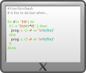

.. idstools documentation master file, created by
   sphinx-quickstart on Wed Apr 26 08:39:37 2023.
   You can adapt this file completely to your liking, but it should at least
   contain the root `toctree` directive.

====================================
Welcome to IDSTools's documentation!
====================================
*IDSTools* is a collection of apps for modifying and getting valuable information 
from Interface Data Structures (IDSs). It includes a library of routines for 
retrieving relevant data from IDSes.
It also offers readily available various forms of visualizations. 
These tools were created in conjunction with scientists and software developers 
from the fusion community. The goal of having a common set of functions in 
the *IDSTools* is to reduce the work of reinventing the wheel by utilizing accessible functions.

It provides:

- Scripts for daily use of IMAS operations
- A set of quickly available functions and libraries, as well as an additional set of readily available visualization scripts.

.. toctree::
   :maxdepth: 2
   
   install.rst
   
.. raw:: html

   

   
.. toctree::
   :maxdepth: 1
   
   usersguide.rst

.. raw:: html

   

   
.. toctree::
   :maxdepth: 2

   api.rst

.. raw:: html

   

   

   
.. toctree::
   :maxdepth: 2

   support.rst

License
-------

.. literalinclude:: ../../LICENSE.md
   :language: text

Sitemap
-------

* :ref:`genindex`
* :ref:`modindex`
* :ref:`search`
